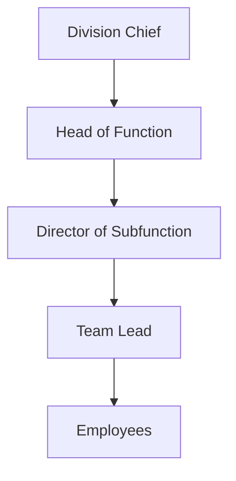

# Project Portfolio Management & Capacity Planning (PPM)

## 1. Purpose

Build a project portfolio management and capacity planning application that supports:

*   **Monthly resource allocation** by role
*   **Ramp-up / ramp-down** of demand over time
*   **Cross-year planning** (multi-year horizon)
*   **Organizational ownership** and hierarchy
*   **Team-based capacity pools**
*   **Priority-based** portfolio tradeoffs
*   **What-if scenario simulations** (drop, delay, reprioritize projects)
*   **DuckDB** as the analytical storage engine

> **The core question the system must answer:**
> “Given our people, roles, levels, and priorities — can we deliver this portfolio over time?”

---

## 2. Core Concepts

### High-Level Domains
*   **Organization**: Hierarchy and ownership
*   **Resources**: Employees, roles, levels, teams
*   **Projects**: Timelines, priorities, role demand
*   **Allocations**: Monthly FTE requirements
*   **Scenarios**: Baseline and what-if simulations
*   **Capacity**: Available FTE by role, team, org unit

---

## 3. Organization & Ownership Model

### Hierarchy


### Organizational Units
Each org unit has a parent, forming a tree.
**Types**: `division`, `function`, `subfunction`, `team`

### Ownership Rules
| Role | Ownership Scope |
| :--- | :--- |
| **Chief** | Entire division |
| **Head of Function** | All subfunctions |
| **Director** | Subfunction |
| **Team Lead** | Team |
| **Employee** | Self |

*Ownership determines visibility, approval rights, reporting rollups, and scenario permissions.*

---

## 4. Teams

*   Teams are **capacity pools**.
*   Each employee belongs to **exactly one team**.
*   Each team has a designated **team lead**.
*   **Capacity rolls up**: Employee → Team → Subfunction → Function → Division.

---

## 5. Resource Model

### Roles
Functional capability, independent of seniority.
*   Backend Engineer, Frontend Engineer, QA Engineer, Data Engineer
*   Product Manager, Delivery Manager, Solution Architect

### Levels (Global)
*   Officer, Senior Officer
*   Expert / Manager, Senior Expert / Senior Manager
*   Director, Senior Director
*   Chief

### Employees
Each employee has:
*   One role, one level, one team
*   FTE capacity (default = 1.0)
*   Active date range

---

## 6. Project Model

### Project Attributes
*   **Name**, **Priority** (numeric or P1–P5)
*   **Planned Dates**: Start and End
*   **Status**: Planned, Active, Paused, Cancelled
*   **Portfolio Grouping** (optional)

### Important Rules
*   Priority does **not** define schedule.
*   Priority is only used when demand exceeds capacity.
*   Projects may cross calendar and fiscal years.

---

## 7. Allocation Model (Core)

### Allocation Granularity
*   **Monthly**
*   **Role-based** (not person-based)

### Example Allocation
| Month | Role | Required FTE |
| :--- | :--- | :--- |
| 2026-01 | Backend Engineer | 1.5 |
| 2026-02 | Backend Engineer | 3.0 |
| 2026-03 | Backend Engineer | 4.0 |
| 2026-06 | Backend Engineer | 1.0 |

*Supports ramp-up, ramp-down, partial FTEs, hiring assumptions, and contractor modeling.*

---

## 8. Cross-Year Planning

Use a calendar month spine to support:
*   **Rolling 18–36 month** horizons
*   **Cross-year** simulations
*   **Fiscal year** reporting
*   **Long-range** runway analysis

---

## 9. Scenario & What-If Modeling

### Scenario Types
*   `BASELINE`
*   `WHAT_IF`

### Scenario Capabilities
A scenario can override:
*   Project inclusion/exclusion, dates, and priority.
*   Allocation curves.
*   *Note: Baseline data is never mutated.*

### Example What-Ifs
*   Drop a project entirely.
*   Delay project start by N months.
*   Reprioritize competing projects.
*   Compare multiple scenarios side-by-side.

---

## 10. Capacity & Allocation Resolution Logic

### Available Capacity
Calculated monthly as `sum(employee.fte_capacity)` grouped by role, team, and org unit.

### Demand
`sum(project_role_allocation.required_fte)`

### Resolution Algorithm
When **demand > capacity**:
1.  Sort projects by priority (descending).
2.  Allocate capacity in priority order.
3.  Track unmet demand.
4.  Flag risks and bottlenecks.

---

## 11. Key Outputs & Metrics

*   Overallocated roles by month
*   Underutilized capacity
*   Project delivery risk
*   Hiring gaps by role & level
*   Team-level overloads
*   Org-unit rollups
*   Scenario comparison diffs

---

## 12. DuckDB Schema (Core Tables)

```sql
-- Resources & Organization
CREATE TABLE employee (id, name, role_id, level, team_id, fte_capacity, active_from, active_to);
CREATE TABLE role (id, name);
CREATE TABLE org_unit (id, name, type, parent_id);
CREATE TABLE team (id, name, lead_employee_id, org_unit_id);

-- Projects & Allocations
CREATE TABLE project (id, name, priority, planned_start, planned_end, status);
CREATE TABLE project_role_allocation (project_id, role_id, month_date, required_fte);

-- Scenarios
CREATE TABLE scenario (id, name, type);
CREATE TABLE scenario_project_override (scenario_id, project_id, included, start_override, end_override, priority_override);

-- Dimension Tables
CREATE TABLE calendar_month (month_date, year, quarter, month);
```

---

## 14. Non-Goals (Explicit)

*   No real-time task tracking
*   No individual task assignment (future extension)
*   No payroll or HR system replacement

---

## 15. Future Extensions (Optional)

*   Cost rates per level
*   Contractor vs permanent modeling
*   Hiring lead times
*   Skill tagging
*   Optimization solvers (OR-Tools / PuLP)
*   Monte Carlo schedule risk
*   BI dashboards (DuckDB + WASM)
*   AI-driven scenario analysis
